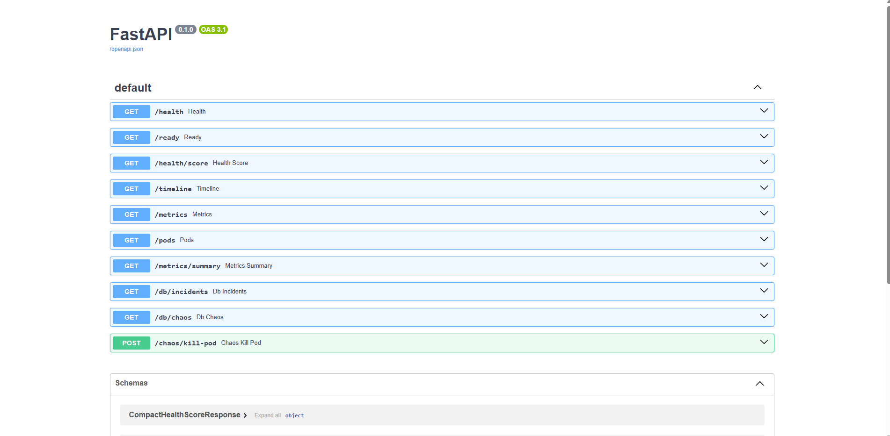
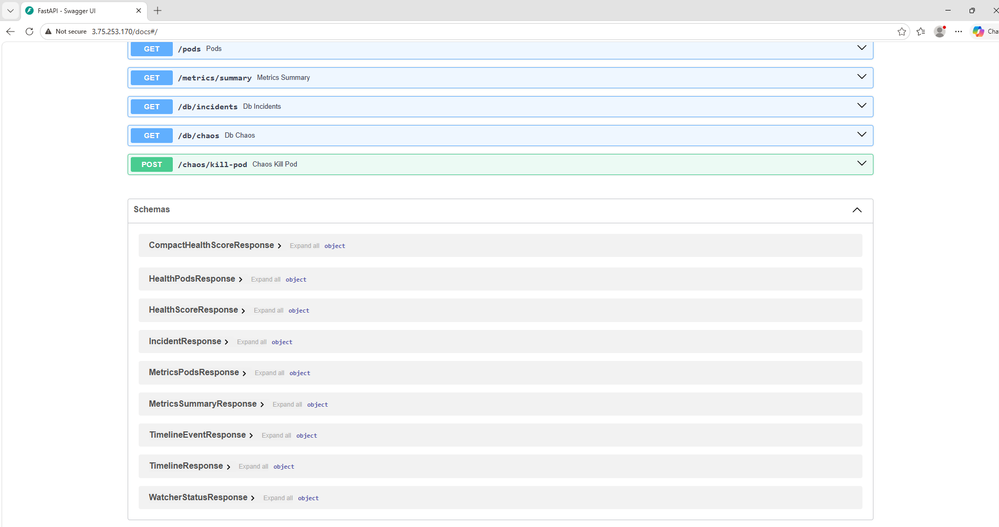
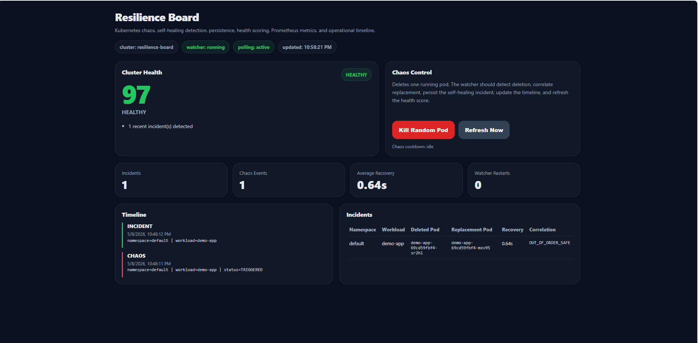

# Resilience Board

## Live Deployment

## Demo Video

[Watch the Full Chaos Recovery Demo](https://youtu.be/lXCiAZh3QTA)

Public API:

* http://3.75.253.170/docs
* http://3.75.253.170/health
* http://3.75.253.170/health/score
* http://3.75.253.170/metrics

Production Infrastructure:

* AWS EC2
* k3s Kubernetes
* Nginx reverse proxy
* Amazon ECR
* Docker
* Elastic IP
* IAM role-based image pulls

## API Documentation

### OpenAPI Endpoints



### OpenAPI Schemas



### Resilience Board Dashboard



---

# Overview

Resilience Board is a Kubernetes chaos engineering and operational observability platform focused on real-time self-healing infrastructure behavior.

The system injects controlled Kubernetes workload failures, monitors pod lifecycle events in real time, correlates deleted and replacement workloads, measures recovery duration, persists resilience incidents, computes operational health scoring, exposes Prometheus-compatible metrics, and provides runtime telemetry APIs through a public FastAPI service.

This project was engineered as a backend/platform infrastructure system rather than a CRUD application.

---

# Why This Project Exists

Most portfolio projects demonstrate request/response CRUD patterns.

Resilience Board was designed to demonstrate real infrastructure and backend engineering concepts including:

* Kubernetes orchestration
* distributed systems behavior
* chaos engineering
* runtime observability
* self-healing recovery detection
* operational telemetry
* container orchestration
* event-driven backend systems
* cloud infrastructure deployment
* infrastructure-aware backend design
* resilience monitoring
* production-style platform engineering

---

# Technology Stack

## Backend

* Python
* FastAPI
* SQLAlchemy
* Uvicorn

## Infrastructure

* AWS EC2
* k3s Kubernetes
* Docker
* Nginx
* Amazon ECR
* IAM
* Elastic IP

## Observability

* Prometheus-compatible metrics
* operational health scoring
* runtime telemetry
* resilience event tracking

## Persistence

* SQLite

## Testing / CI

* pytest
* GitHub Actions

---

# What It Demonstrates

* Kubernetes API integration from Python
* In-cluster authentication through ServiceAccount and RBAC
* Kubernetes workload lifecycle monitoring
* Background event watcher architecture
* Controlled chaos experiment execution
* Autonomous self-healing recovery detection
* Recovery-time correlation
* Runtime incident persistence
* Operational health scoring
* Prometheus-compatible metrics rendering
* Operational telemetry APIs
* Dockerized backend deployment
* Kubernetes manifests for deployment and RBAC
* Public AWS cloud deployment
* Amazon ECR registry workflow
* IAM role-based image authentication
* GitHub Actions CI pipeline
* Production-style deployment architecture
* Reverse proxy integration through Nginx
* Infrastructure-aware failure handling

---

# Current Status

Implemented and verified:

* FastAPI backend
* Kubernetes watcher
* pod deletion detection
* replacement pod correlation
* self-healing recovery tracking
* resilience incident persistence
* chaos experiment persistence
* operational health scoring
* Prometheus metrics endpoint
* timeline aggregation endpoint
* Dockerized runtime
* Kubernetes deployment manifests
* k3s single-node cluster deployment
* AWS EC2 deployment
* Amazon ECR integration
* Elastic IP public exposure
* IAM role-based container pulls
* Nginx reverse proxy integration
* GitHub Actions CI
* automated backend test suite

Current live deployment:

* Public FastAPI documentation endpoint
* Public metrics endpoint
* Public health scoring endpoint
* Public operational dashboard
* Kubernetes-backed runtime infrastructure

---

# Production Deployment

Resilience Board is publicly deployed on AWS infrastructure.

Current deployment architecture:

```text
GitHub
   |
   v
GitHub Actions CI
   |
   v
Docker Image Build
   |
   v
Amazon ECR
   |
   v
AWS EC2 Instance
   |
   |-- Nginx Reverse Proxy
   |-- k3s Kubernetes Cluster
   |
   v
Kubernetes NodePort Service
   |
   v
FastAPI Application Pod
   |
   |-- Operational APIs
   |-- Chaos Execution
   |-- Health Scoring
   |-- Metrics Rendering
   |-- Timeline Aggregation
   |
   v
Kubernetes Watcher
   |
   |-- Pod lifecycle monitoring
   |-- Self-healing correlation
   |-- Recovery-time measurement
   |
   v
SQLite Persistence
```

Infrastructure currently includes:

* Ubuntu 24.04 EC2 instance
* k3s Kubernetes runtime
* Nginx reverse proxy
* Amazon ECR image registry
* Elastic IP public endpoint
* IAM role-based ECR authentication
* Kubernetes NodePort networking

---

# Architecture Overview

```text
User / API Client
        |
        v
Nginx Reverse Proxy
        |
        v
Kubernetes NodePort Service
        |
        v
FastAPI Backend
        |
        |-- API routes
        |-- health scoring
        |-- metrics rendering
        |-- chaos execution
        |-- timeline aggregation
        |
        v
Kubernetes Client
        |
        |-- list workloads
        |-- watch pod events
        |-- delete selected workloads
        |
        v
Kubernetes Cluster
        |
        |-- Deployment recreates deleted workloads
        |-- Watcher detects replacement workloads
        |
        v
Persistence Layer
        |
        |-- incidents
        |-- chaos experiments
        |-- recovery telemetry
        |
        v
SQLite
```

---

# Repository Structure

```text
resilience-board/
├── .github/
│   └── workflows/
│       └── ci.yml
├── README.md
├── pytest.ini
├── backend/
│   ├── main.py
│   ├── Dockerfile
│   ├── requirements.txt
│   ├── app/
│   │   ├── schemas.py
│   │   ├── metrics.py
│   │   ├── db/
│   │   │   ├── models.py
│   │   │   └── session.py
│   │   ├── kubernetes/
│   │   │   └── client.py
│   │   ├── runtime/
│   │   │   └── state.py
│   │   └── services/
│   │       ├── health.py
│   │       ├── persistence.py
│   │       ├── pods.py
│   │       ├── time.py
│   │       └── watcher.py
│   ├── frontend/
│   ├── static/
│   ├── k8s/
│   │   ├── namespace.yaml
│   │   ├── rbac.yaml
│   │   ├── deployment.yaml
│   │   └── service.yaml
│   └── tests/
│       └── test_resilience.py
```

---

# Core Backend Components

## backend/main.py

FastAPI application entry point.

Responsibilities:

* registers API routes
* initializes Kubernetes integrations
* starts the operational watcher
* exposes health endpoints
* exposes metrics endpoints
* exposes persistence inspection endpoints
* exposes chaos execution endpoints
* exposes timeline aggregation APIs

---

## backend/app/services/watcher.py

Concurrent Kubernetes watcher service.

Responsibilities:

* watches Kubernetes pod lifecycle events
* detects deleted workloads
* detects replacement workloads
* correlates self-healing events
* records recovery timing
* persists resilience incidents
* updates runtime watcher state
* maintains operational telemetry state

---

## backend/app/services/health.py

Operational health scoring service.

Responsibilities:

* loads Kubernetes client state
* evaluates cluster runtime state
* evaluates watcher operational state
* computes resilience health scoring
* safely degrades when Kubernetes becomes unavailable

---

## backend/app/services/persistence.py

Persistence abstraction layer.

Responsibilities:

* stores resilience incidents
* stores chaos experiments
* prevents duplicate insertions
* converts ORM records into API-safe structures
* isolates persistence logic from orchestration logic

---

## backend/app/services/pods.py

Kubernetes workload helper.

Responsibilities:

* maps pod labels to workload identities
* supports workload-level recovery correlation
* normalizes Kubernetes workload metadata

---

## backend/app/runtime/state.py

Shared runtime operational state.

Responsibilities:

* tracks deleted workloads
* tracks replacement workloads
* stores watcher runtime status
* stores operational incidents
* provides concurrency-safe shared runtime state

---

# API Surface

## Health and Readiness

```http
GET /health
GET /ready
GET /health/score
```

## Kubernetes Workload View

```http
GET /pods
```

## Chaos Execution

```http
POST /chaos/kill-pod
```

## Timeline

```http
GET /timeline
```

## Persistence Inspection

```http
GET /db/incidents
GET /db/chaos
```

## Metrics

```http
GET /metrics
GET /metrics/summary
```

---

# Running Tests

```bash
env -u PYTHONPATH pytest -q
```

Current verified result:

```text
23 passed
```

---

# Docker

Build:

```bash
docker build -t resilience-board-api:local backend
```

Run:

```bash
docker run --rm -p 8000:8000 resilience-board-api:local
```

---

# Kubernetes Deployment

```bash
docker build -t resilience-board-api:latest backend

kubectl apply -f backend/k8s/namespace.yaml
kubectl apply -f backend/k8s/rbac.yaml
kubectl apply -f backend/k8s/deployment.yaml
kubectl apply -f backend/k8s/service.yaml
```

---

# AWS Deployment

Public deployment currently runs on:

* AWS EC2
* k3s Kubernetes
* Nginx reverse proxy
* Amazon ECR
* Elastic IP
* IAM instance profile authentication

Container image registry:

```text
227270320785.dkr.ecr.eu-central-1.amazonaws.com/resilience-board-api:latest
```

---

# CI

GitHub Actions currently performs:

1. repository checkout
2. Python 3.12 setup
3. dependency installation
4. pytest execution
5. Docker image build validation

Workflow:

```text
.github/workflows/ci.yml
```

---

# Engineering Challenges Solved

Key engineering problems solved during development:

* Safe degradation when Kubernetes configuration becomes unavailable
* Runtime-safe Kubernetes client initialization
* Recovery from accidental FastAPI route deletion during refactoring
* CI stabilization without live Kubernetes access
* Self-healing correlation for replacement workloads
* Separation of orchestration and business logic into service layers
* ECR authentication through IAM roles instead of static credentials
* Runtime-safe watcher state handling
* Reverse proxy integration through Nginx
* Kubernetes deployment migration from local development to cloud infrastructure
* Public cloud deployment verification
* Failure-safe chaos execution handling

---

# Dashboard

The project includes an operational dashboard built using:

* HTML
* CSS
* JavaScript

Dashboard capabilities include:

* cluster health visualization
* resilience incident display
* operational metrics rendering
* timeline visualization
* chaos execution controls
* runtime telemetry display

---

# Engineering Notes

* watcher runtime is concurrency-sensitive
* tests do not require a live Kubernetes cluster
* Kubernetes interactions are mocked during CI
* runtime SQLite databases are ignored by Git
* health scoring safely degrades outside Kubernetes
* watcher state is maintained separately from persistence state
* Kubernetes workloads recover automatically through deployment reconciliation
* operational APIs remain available during degraded Kubernetes states

---

# Future Infrastructure Improvements

* HTTPS with domain-based TLS
* Terraform infrastructure provisioning
* PostgreSQL / Amazon RDS migration
* Prometheus + Grafana observability stack
* Multi-node Kubernetes deployment
* Kubernetes ingress controller
* release tagging strategy
* automated deployment pipelines
* infrastructure monitoring
* distributed persistence layer
* architecture diagrams
* production hardening
